# eSpeak 开发计划（分步 · 可前端验证）

> 每步完成后在浏览器（375px）或注明处验收，**PASS 再进下一步**。  
> 配套：[harness.md](./harness.md)（闭环规则与用例）、[REQUIREMENTS.md](./REQUIREMENTS.md)（需求全文）。

---

## 总览

| 阶段 | 步骤 | 目标 |
|------|------|------|
| **A 基础壳** | S0–S1 | 工程脚手架 + 路由壳 |
| **B 数据与列表** | S2–S3 | Dexie + 15 情景首页 |
| **C 设置与 LLM** | S4–S5 | Key 配置 + 流式对话 |
| **D 聊天闭环** | S6–S7 | 完整聊天 UI + TTS |
| **E 语音与历史** | S8–S10 | STT + 历史页 |
| **F Android** | S11 | Capacitor 打包真机 |
| **G 表达错误** | S12–S13 | 检测入库 + 结束摘要 |
| **H 复习闭环** | S14–S16 | Anki + 复习对话 |

```mermaid
gantt
  title 实施顺序（依赖关系）
  dateFormat X
  axisFormat %s
  section A
  S0脚手架 :0, 1
  S1MobileShell :1, 2
  section B
  S2Dexie :2, 3
  S3首页 :3, 4
  section C
  S4设置 :4, 5
  S5LLM :5, 6
  section D
  S6聊天UI :6, 7
  S7TTS :7, 8
  section E
  S8STT :8, 9
  S9Provider链 :9, 10
  S10历史 :10, 11
  section F
  S11Android :11, 12
  section G
  S12表达检测 :12, 13
  S13结束摘要 :13, 14
  section H
  S14Anki :14, 15
  S15复习面板 :15, 16
  S16复习对话 :16, 17
```



---

## 阶段 A — 基础壳

### S0 工程脚手架

**交付**
- Vite + React 19 + TypeScript + React Router
- Tailwind CSS 4、Sonner、路径别名
- `package.json` 脚本：`dev` / `build` / `cap:sync` / `install:android` / `lint`
- 移动端 viewport meta、375px 基准样式

**前端验证**
- [ ] `pnpm install && pnpm dev` 无报错
- [ ] `pnpm lint`（tsc --noEmit）通过
- [ ] 浏览器见占位页

---

### S1 MobileShell + 路由

**交付**
- `MobileShell`：顶栏 + 底栏三 Tab（练习 / 复习 / 设置）
- Safe area、暗色模式
- 路由：`/`、`/chat/:id`、`/history`、`/review`、`/review/session/:reviewCardId`、`/settings`
- 聊天页、复习对话页 `hideTabs`

**前端验证**
- [ ] 375px 下三 Tab 可切换，路由正确
- [ ] 进入 `/chat/1`、`/review/session/1` 底栏隐藏
- [ ] 顶栏标题随路由变化

---

## 阶段 B — 数据与列表

### S2 Dexie 数据层

**交付**
- 表：`userSettings`、`scenarios`、`conversations`、`messages`、`errorRecords`、`reviewCards`
- `seedScenarios()`：15 情景（5 分类 × 3 难度）
- `db.version().upgrade()` migration 骨架
- 默认 `userSettings` 单例

**前端验证**
- [ ] 首次打开 IndexedDB 有 15 条 `scenarios`
- [ ] 刷新后 seed 不重复插入
- [ ] DevTools 可看到空表 `errorRecords`、`reviewCards`

---

### S3 首页（情景列表）

**交付**
- 分类 Tab + 搜索（title/description 中文）
- 情景卡片：标题、描述、难度 badge、分类
- 点击创建 `Conversation(type=practice)` 并跳转 `/chat/:id`

**前端验证**
- [ ] 筛选「daily_life」仅显示 3 条
- [ ] 搜索「餐厅」命中对应情景
- [ ] 点击卡片进入聊天路由，DB 新增 conversation

---

## 阶段 C — 设置与 LLM

### S4 设置页

**交付**
- DeepSeek Key、OpenAI Key、国内 STT/TTS Key（备选）
- LLM Provider、模型名、STT/TTS Provider 选择
- TTS 音色、保存按钮
- 验证 / 测试朗读 / 测试识别（可先 stub Toast）
- Mock STT/TTS 开关（可选）

**前端验证**
- [ ] 填写 Key → 保存 → 刷新后仍在 `userSettings`
- [ ] 未配置 Key 点验证 → 明确 Toast
- [ ] Mock 开关开启后测试按钮不报错

---

### S5 LLM Provider + 流式

**交付**
- `lib/providers/llm/deepseek.ts`、`openai.ts`
- `lib/providers/chain.ts` 统一入口
- `useChatStream`：创建 user/assistant 消息、SSE 流式追加、`status: streaming | complete | failed`
- 情景 `systemPrompt` 注入

**前端验证**
- [ ] 配置 DeepSeek Key，临时测试页或下一步聊天可收到流式英文
- [ ] 断网 → Toast，消息标记 failed，可重试
- [ ] assistant 消息写入 IndexedDB

---

## 阶段 D — 聊天闭环

### S6 聊天页 UI

**交付**
- 消息气泡、输入框、发送、结束对话
- 流式打字效果、失败重试
- `Conversation.status`：active / ended
- 结束后跳转历史或停留并禁用输入

**前端验证**
- [ ] 多轮对话气泡顺序正确
- [ ] 流式过程中内容持续增长
- [ ] 「结束对话」→ status=ended
- [ ] 刷新页面消息仍在

---

### S7 TTS 朗读

**交付**
- `lib/providers/tts/edge.ts`（~500 字分句、队列播放）
- `useAudioPlayer`
- AI 消息下方「朗读」按钮

**前端验证**
- [ ] 点朗读听到英文（浏览器可播放 MP3）
- [ ] 长回复分句不超时
- [ ] 失败 Toast（可断网测）

---

## 阶段 E — 语音与历史

### S8 STT + 录音 Hook

**交付**
- Web 开发：`MediaRecorder` 或 Mock 返回固定文本
- `useVoiceRecorder`：idle → recording → transcribing → done/error
- `lib/providers/stt/whisper.ts`
- 麦克风按钮：停止后文字填入输入框
- 最长 60s、处理中禁用发送

**前端验证**
- [ ] Mock 模式：点麦克风 → 输入框出现 Mock 文本
- [ ] 配 OpenAI Key：浏览器录音 → Whisper → 文本（Chrome 需授权麦克风）
- [ ] 无 Key Toast 提示

---

### S9 Provider 链 + 国内备选

**交付**
- STT/TTS 国内备选 Provider 各 1 个（接口抽象即可，README 文档化 Key）
- 主失败自动 fallback + Toast
- 设置页测试按钮走完整链

**前端验证**
- [ ] 故意配错主 STT → fallback 或明确错误
- [ ] 测试朗读/识别走当前选中 Provider

---

### S10 对话历史页

**交付**
- `/history`：列表、按分类/情景筛选
- 继续对话、删除（级联 messages）
- 练习 Tab 入口（顶栏或首页链接）
- 首页卡片「进行中」小圆点（optional，有 active 对话时）

**前端验证**
- [ ] 列表显示情景名、摘要、时间
- [ ] 继续 → 回到 `/chat/:id` 消息完整
- [ ] 删除后列表与 DB 一致

---

## 阶段 F — Android

### S11 Capacitor Android

**交付**
- Capacitor 8 初始化、`android/` 工程
- VoiceRecorder 原生插件（Java + TS 定义）
- 权限、`MainActivity` 注册、Java 21
- `pnpm install:android` 脚本与 README

**前端验证（真机）**
- [ ] Debug APK 安装成功
- [ ] 麦克风权限弹窗
- [ ] 录音 → Whisper → 输入框（与 S8 相同逻辑）
- [ ] Chrome `chrome://inspect` 可调试 WebView

---

## 阶段 G — 表达错误（Phase 2）

### S12 表达错误检测

**交付**
- `lib/prompts/expression-detect.ts`
- 用户消息发送后**异步**检测，不阻塞 AI 回复
- 写入 `ErrorRecord` + 创建 `ReviewCard`（due=now）
- harness.md E1–E4 人工用例可测

**前端验证**
- [ ] 发 `I very like it` → IndexedDB 有 errorRecord
- [ ] 发 `He go to school` → **无** errorRecord
- [ ] 同一 message 不重复入库

---

### S13 对话结束摘要

**交付**
- 结束对话后展示本次表达错误列表（原句 → 正确说法 + 中文说明）
- 无错误时友好空状态

**前端验证**
- [ ] 有错误的对话结束 → 摘要页/弹层正确
- [ ] 无错误 → 不报错

---

## 阶段 H — 复习闭环（Phase 2）

### S14 Anki 调度器

**交付**
- `lib/anki-scheduler.ts`：again / hard / good / easy
- `ReviewCard` 读写 service
- 设置页 Dev：手动把某 card 的 `due` 设为过去（可选）

**前端验证**
- [ ] 控制台或 Dev 操作：good 后 `interval`、`due` 变化符合 harness.md §5
- [ ] again 后短间隔内 due 到期

---

### S15 复习面板

**交付**
- `/review`：今日待复习数、列表（原表达摘要、正确说法预览、到期时间）
- 点击进入 `/review/session/:reviewCardId`
- Phase 1 占位改为完整 UI

**前端验证**
- [ ] 仅 `due <= now` 出现在列表
- [ ] 数量与 IndexedDB 一致
- [ ] 空状态文案正确

---

### S16 复习对话会话

**交付**
- `Conversation.type = review`，关联 `reviewCardId`
- `lib/prompts/review-guide.ts`、`review-judge.ts`
- 聊天 UI 复用 + 复习专用 system prompt
- 达标后 Anki 四档按钮，更新 card 并返回复习列表
- harness.md R1–R5 可测

**前端验证**
- [ ] AI 不首轮泄露答案
- [ ] 用户说出正确表达 → Judge 通过 → 四档按钮
- [ ] 点「忘了」→  soon 再次出现在待复习
- [ ] 点「不错」→ due 推后

---

## 当前进度追踪

| 步骤 | 状态 | 完成日期 |
|------|------|----------|
| S0 | ✅ 完成 | 2026-07-02 |
| S1 | ✅ 完成 | 2026-07-02 |
| S2 | ✅ 完成 | 2026-07-02 |
| S3 | ✅ 完成 | 2026-07-02 |
| S4 | ✅ 完成 | 2026-07-02 |
| S5 | ✅ 完成 | 2026-07-02 |
| S6 | ✅ 完成 | 2026-07-02 |
| S7 | ✅ 完成 | 2026-07-02 |
| S8 | ✅ 完成 | 2026-07-02 |
| S9 | ✅ 完成 | 2026-07-02 |
| S10 | ✅ 完成 | 2026-07-02 |
| S11 | ✅ 完成 | 2026-07-02 |
| S12 | ✅ 完成 | 2026-07-02 |
| S13 | ✅ 完成 | 2026-07-02 |
| S14 | ✅ 完成 | 2026-07-02 |
| S15 | ✅ 完成 | 2026-07-02 |
| S16 | ✅ 完成 | 2026-07-02 |

> 实施时在 ⬜ 改为 ✅ 并填日期。

---

## 实施命令速查

```bash
pnpm install
pnpm dev              # 浏览器验证 http://localhost:5173
pnpm lint             # 每步结束跑一遍
pnpm build            # 阶段结束前
pnpm cap:sync         # Android 前
pnpm install:android  # 真机安装
```

---

## 下一步

**从 S0 开始**：初始化 Vite 工程与目录结构。  
确认本计划后，对 Agent 说「执行 S0」或「开始实施」即可逐步推进。
