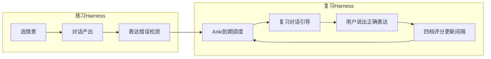

# eSpeak Harness 工程说明

> **Harness 在本项目中的含义**：把「情景对话 → 表达错误 → 对话复习 → Anki 调度」做成**可逐步验证的产品闭环**，每一步都能在浏览器（375px）或真机上手动验收。  
> **不包含**：单元测试、eval 脚本、CI 自动化测试。

---

## 1. 闭环定义



**Harness 成功标准**：用户能在真实对话中说错 → 系统只记录表达错误 → 到期后通过 AI 引导对话练回正确说法 → 间隔按 Anki 拉长。

---

## 2. 三层结构

| 层 | 职责 | 主要位置 |
|----|------|----------|
| **Control** | Prompt、Provider 配置、Anki 规则、Seed 数据 | `src/lib/prompts/`、`src/lib/providers/`、`src/lib/anki-scheduler.ts` |
| **Runtime** | 页面、Hook、对话流、录音播放 | `src/pages/`、`src/hooks/` |
| **Storage** | 持久化与查询 | `src/lib/db/` |

页面不直接 `fetch` 外部 API，一律走 Provider 层，便于 Mock 与真机切换。

---

## 3. 表达错误 Harness（Phase 2）

### 3.1 判定标准（写进 Prompt，人工抽检）

| 记为表达错误 | 不记 |
|--------------|------|
| 中式英语、不地道说法 | 纯语法形式（时态/单复数填空） |
| 搭配/习语错误 | 拼写、标点 |
| 同场景明显更自然的替换 | 原句已可接受、仅「更好」的同义替换 |
| 语用不当（礼貌/语气） | LLM 臆测 |

### 3.2 LLM 输出契约

```json
{
  "isExpressionError": true,
  "severity": "medium",
  "originalExpression": "I very like it.",
  "correctExpression": "I really like it.",
  "explanationZh": "英语里程度副词不用 very 直接修饰动词 like。"
}
```

- `isExpressionError: false` → 不入库
- 同一 `messageId` 只保留一条 `ErrorRecord`
- 入库时同步创建 `ReviewCard`（`due = now`，立即可复习）

### 3.3 人工验证用例（浏览器 DevTools → Application → IndexedDB）

| # | 用户输入 | 期望 |
|---|----------|------|
| E1 | `I very like this dish.` | 产生 ErrorRecord |
| E2 | `He go to school yesterday.` | **不**产生（纯时态） |
| E3 | `Can you open the light?` | 产生（open → turn on） |
| E4 | `Hello, how are you?` | 不产生 |

---

## 4. 复习对话 Harness（Phase 2）

### 4.1 复习不是闪卡

- ❌ 正面/背面卡片、选择题、默写框
- ✅ `Conversation.type = 'review'` 的 mini 对话，AI 引导用户**口头或文字产出** `correctExpression`

### 4.2 复习对话规则

1. AI **不得**在第一轮直接给出 `correctExpression`
2. 2–4 轮内通过情景/question 引导用户说出
3. `review-judge` Prompt 判定达标（语义等价、关键搭配正确即可）
4. 达标后展示 Anki 四档：**忘了 / 困难 / 不错 / 简单**
5. 评分写入 `ReviewCard`，更新 `due`

### 4.3 人工验证用例

| # | 操作 | 期望 |
|---|------|------|
| R1 | 复习 Tab 显示 `due <= now` 的数量 | 与 IndexedDB `reviewCards` 一致 |
| R2 | 进入复习对话 | AI 开场与错题场景相关，不泄露答案 |
| R3 | 用户说出正确说法 | Judge 通过 → 出现四档按钮 |
| R4 | 点「忘了」 | `due` ≈ 1–10 分钟后，列表再次出现 |
| R5 | 点「不错」 | `interval` 增大，`due` 推后 |

---

## 5. Anki 调度 Harness

实现：`src/lib/anki-scheduler.ts`（对照 Anki SM-2，不写测试文件）

| 字段 | 初始值 | 说明 |
|------|--------|------|
| `easeFactor` | 2.5 | 难度系数 |
| `interval` | 0 | 天 |
| `reps` | 0 | 成功次数 |
| `lapses` | 0 | 遗忘次数 |
| `due` | `Date.now()` | 新卡片立即可复习 |

| 评分 | rating | 效果（概要） |
|------|--------|--------------|
| 忘了 | again | 重置 interval，`lapses++`，短间隔再考 |
| 困难 | hard | interval × 1.2，ease − 0.15 |
| 不错 | good | 标准 SM-2 推进 |
| 简单 | easy | interval × 1.3，ease + 0.15 |

**前端验证**：设置页 Dev 区可手动改 `reviewCards.due` 为过去时间戳，刷新复习 Tab 应出现该条。

---

## 6. Provider Harness

| Provider | 主方案 | 备选 | 前端验证方式 |
|----------|--------|------|--------------|
| LLM | DeepSeek | OpenAI | 设置页「验证」→ Toast 成功 |
| STT | Whisper | 国内 STT | 「测试识别」或聊天麦克风 |
| TTS | Edge TTS | 国内 TTS | 「测试朗读」或消息朗读按钮 |

- 主 Provider 失败 → Toast + 自动 fallback（若已配置备选）
- 设置页 **Mock STT/TTS** 开关：无 Key 时返回固定文本/静音，用于纯 UI 步进

---

## 7. 分步验收索引

完整步骤见 [DEVELOPMENT_PLAN.md](./DEVELOPMENT_PLAN.md)。每步必须 **PASS** 后再进入下一步。

| 阶段 | 步编号 | 前端可验证？ |
|------|--------|--------------|
| 脚手架 | S0–S1 | ✅ 浏览器 375px |
| 数据+首页 | S2–S3 | ✅ |
| 设置+LLM | S4–S5 | ✅（需 Key 或 Mock） |
| 聊天闭环 | S6–S7 | ✅ |
| 语音 | S8–S9 | ⚠️ STT 需 Key；录音需真机 |
| 历史 | S10 | ✅ |
| Android | S11 | 真机 USB |
| 表达错误 | S12–S13 | ✅ |
| 复习闭环 | S14–S16 | ✅ |

---

## 8. 浏览器开发预览约定

- 视口：**375px** 宽（Chrome DevTools iPhone SE / 自定义）
- 命令：`pnpm dev` → `http://localhost:5173`
- 数据：Chrome → Application → IndexedDB → `espeak`
- 网络：DevTools → Network 断网模拟「无网 Toast」
- 刷新/关 tab 后再开 → 验证 Dexie 持久化

---

## 9. 真机验收（最终 Harness）

Phase 1 六项 + 历史（华为 USB）：

1. 配置 DeepSeek + OpenAI Key → 保存
2. 选「餐厅点餐」→ 英文文字 → 流式回复
3. AI 消息「朗读」→ 听到英文
4. 麦克风 → 说英文 → 停止 → 输入框出现文字
5. 杀进程重开 → 历史仍在
6. 断网 → Toast，不白屏

Phase 2 追加：

7. 中式英语 → 仅表达错误入库
8. 复习对话引导 → 四档评分 → 间隔更新

---

## 10. 文档关系

```
REQUIREMENTS.md   ← 功能与约束（唯一需求来源）
harness.md        ← 本文：闭环规则 + 人工验收用例
DEVELOPMENT_PLAN.md ← 分步实施顺序 + 每步 PASS 条件
```

实施 Agent **按 DEVELOPMENT_PLAN 顺序执行**，用本文 §3–§6 用例抽检，不跳步。
